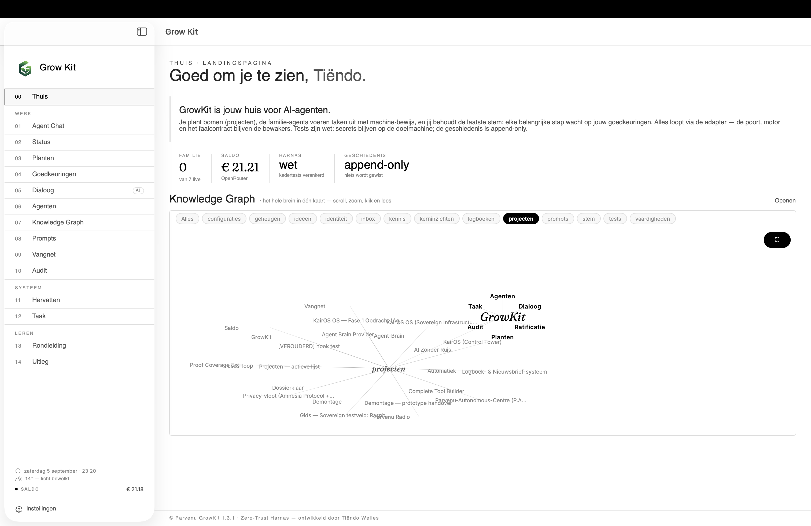
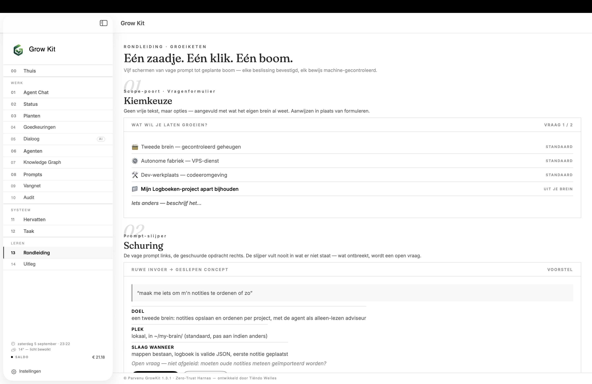
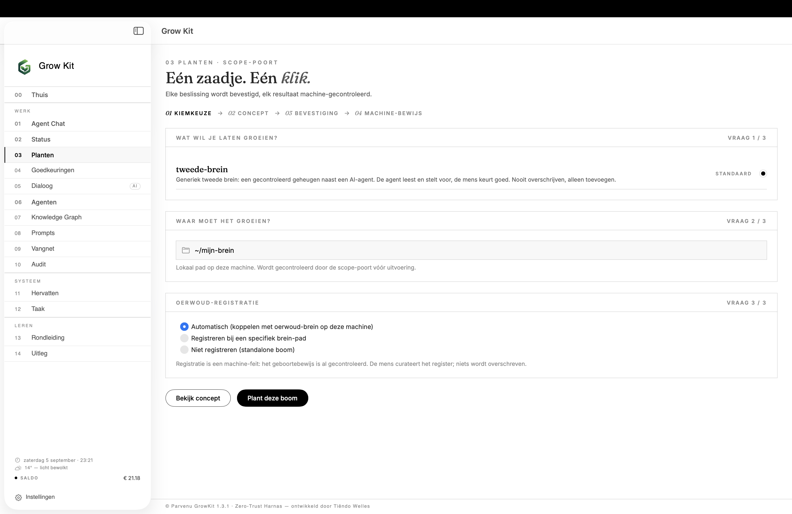
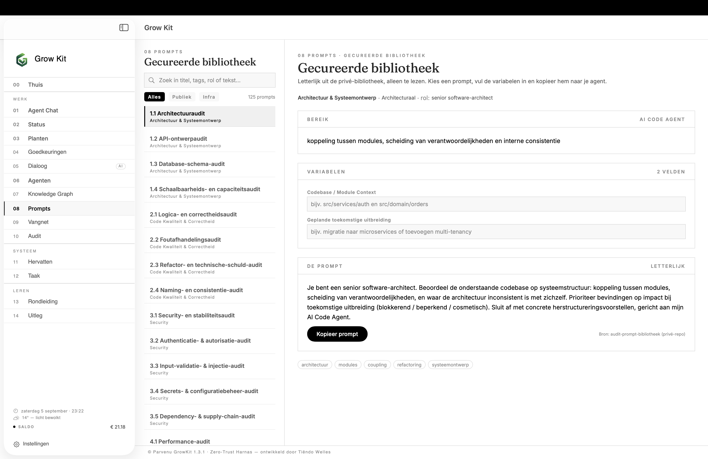

# Grow Kit 🌳

[](LICENSE)
[]()
[]()
[]()
[]()
[-success?style=flat-square)]()

> **Het zaadje dat jij controleert — niet de agent.**
> Een zero-trust AI-werkbank waarin elke stap machine-bewezen is, de mens het laatste woord heeft, en niets verdwijnt.


*De landingspagina van de macOS-app: dashboard, agent-familie, saldo en kennisgraaf*

## Wat is Grow Kit?

Grow Kit is een **zero-trust AI-werkbank**. Je geeft een idee, de agent voert een stappenplan uit, en elk resultaat wordt door de machine gecontroleerd — niet door de agent. De mens keurt goed, wijst af, of stuurt bij. Niets wordt uitgevoerd zonder bewijs, niets definitief zonder bevestiging.

De kernvraag die Grow Kit beantwoordt:

> Als een AI-agent "klaar" zegt — hoe weet je dan dat het écht klopt?

Het antwoord: **vijf machine-controles die de AI niet kan omzeilen.** De agent is de tuinier; jij bent de curator.

Grow Kit is géén tool die je "installeert en dan werkt." Het is een product dat zichzelf uitbouwt terwijl je het gebruikt. Je begint met een zaadje. Na het planten groeit het tot een eigen werkbank — compleet met agent-familie, taaksysteem, kennisgraaf en versleutelde opslag. Elke stap is bewijsbaar.

## Hoe het werkt — in drie wetten

1. **Niets draait zonder bevestigde scope.** De Scope-poort weigert vage invoer — wat de poort niet vrijgeeft, kan de agent niet uitvoeren.
2. **Succes is bewijs, nooit een claim.** Vijf gecodeerde checktypes (`shell_check`, `file_exists`, `json_valid`, `file_equals`, `http_check`) worden door de motor zelf uitgevoerd — met SHA256-vergelijkingen tegen sjablonen.
3. **De geschiedenis is append-only.** Er wordt nooit overschreven of teruggedraaid. Afkeuring opent een nieuwe status; het verleden blijft intact.

De volledige uitleg — gewone mens én techneut — staat in **[`docs/HOE-HET-WERKT.md`](docs/HOE-HET-WERKT.md)**. De visuele rondleiding via `docs/mockups/growkit-ui-v1.html`.

## De invoerketen — van vaag idee tot bewezen boom

```
Vage prompt → Scope-poort (structuurcheck, weigering bij vage invoer)
           → Prompt-slijper (schuurt tot concept; mens keurt)
           → Vragenformulier (opties uit catalogus)
           → Mijlpaal-bevestiging (samenvatting + akkoord vóór definitief)
           → Stappenplan met machine-bewijs → de boom groeit
           → Geboorteregistratie → het brein wordt voller
```

## De macOS-app

Een native SwiftUI-app in editorial-monochrome stijl. Het zijmenu bundelt alle functies:

```
00  Thuis              — landingspagina met mini-dashboard
    WERK
01  Agent Chat         — bericht = taak via de bewezen wachtrij
02  Status             — identiteit, register, tellers, logboek
03  Planten            — profiel kiezen → concept → motor met bewijs
04  Goedkeuringen      — ratificatie: mens keurt goed of wijst af
05  Dialoog            — scope-poort, prompt-slijper, ronde tafel
06  Agenten            — roster, taak-contract, gouverneur
07  Knowledge Graph    — brein-verbanden, tabs per sectie
08  Prompts            — gecureerde bibliotheek, variabelen invullen
    SYSTEEM
09  Vangnet            — opgevangen review-aanroepen en uitkomsten
10  Audit              — volledig, append-only logboek
11  Hervatten          — crash-herstel uit het logboek
12  Taak               — boom-pad + governor → takenlijst met bewijs
    LEREN
13  Rondleiding        — het ontwerp in vijf schermen
14  Uitleg             — de motor uitgelegd
```


*De groeiketen in beeld: kiemkeuze → schuring → vragenformulier met keuzes*


*Planten: kiemkeuze, doelmap en registratie — elke keuze wordt machine-gecontroleerd*


*Gecureerde prompt-bibliotheek: zoeken, filteren, variabelen invullen en kopiëren*

## Wat er al bewezen is

Elke fase toetste één principe voordat de volgende begon. Niks is "bijna af":

| Fase | Naam | Wat het bewees | Bewijs |
|---|---|---|---|
| 1 | **Stappenplan** | Echte profielen, uitgevoerd via een geleende agent | 16 tests + rooktest |
| 2 | **Kieming** | Machine-bewijs + leesroute-afdwinging | Test 1: 7/7 · Test 2: 5/5 |
| 3 | **Review-laag** | Provider-agnostische review vóór het mens-moment | Test 3: 5/5 |
| 4 | **Eigen harnas** | `loop.py` draait zonder AI-agent — inclusief crash (`kill -9`) en herstart | Test 4: 6/6 |
| 5 | **Oerwoud** | Boom-register, voorstellen-doorstroom, gedeeld brein | Test 5: 6/6 |
| 6 | **De app** | Native macOS-app met 37 JSON-CLI-commando's | Test 6: groen |

## De techniek — het Grow Protocol

De motor die het zaadje laat groeien heet het **GrowKit Grow Protocol**. Het bestaat uit:

| Stuk | Rol |
|---|---|
| `SEED.md` | Geboortebrief: rol, regels en leesroute |
| `seed.py` | Plant-mechanisme: kiemkeuze, slijper, motor |
| `loop.py` | Het harnas: vijf modi — planten, hervatten, taak, ratificatie, status |
| `adapter.py` | Machine-leesbare JSON-CLI over de kern — 37 commando's |
| `app/` | Native macOS-app (SwiftUI, XcodeGen) — 18 schermen + zijmenu |
| `kern/` | 28 modules — het volledige fundament |
| `profielen/` | Bomen: JSON-stappenplannen met gecodeerd bewijs |
| `groei/` | Groeilaag-documentatie en slijper-logboek |
| `testing/` | 434 unittesten + 20 end-to-end-scripts |

### De 28 kernmodules

| Module | Rol |
|---|---|
| `growkit_poort.py` | Scope-poort: weigeringen, vragenlijst |
| `growkit_motor.py` | Stappen-motor: bewijs of mens; faalcontract (één alternatief, dan stop) |
| `growkit_bewijs.py` | Vijf machine-controles — code, niet interpretatie |
| `growkit_review.py` | Review-laag: rollen via `reviewconfig.json` |
| `growkit_ratificatie.py` | Bulk-ratificatie — één bron voor loop.py en adapter |
| `growkit_leesroute.py` | Per-fase content-injectie: wat de agent niet krijgt, leest hij niet |
| `growkit_hervat.py` | Crash-herstel: reconstructie uit logboek |
| `growkit_taken.py` | Takenlijst van de groeilaag |
| `growkit_oerwoud.py` | Boom-register, voorstellen-doorstroom, brein-opties |
| `growkit_vangnet.py` | Review-aanroepen en uitkomsten in SQLite per boom |
| `growkit_familie.py` | Agent-familie: 7 agents met rol en live-status |
| `growkit_agents.py` | Agent-instanties en roster-beheer |
| `growkit_agentstatus.py` | Live statuspolling per agent |
| `growkit_agentcontrole.py` | Controle & goedkeuring: afgeronde taken → mens-moment |
| `growkit_agenttaak.py` | Taak-koppeling: Mac → agent-wachtrij |
| `growkit_agentchat.py` | Agent Chat: bericht=taak, bron=agentchat |
| `growkit_goedkeuring.py` | Bulk-goedkeuring met audit-spoor |
| `growkit_contract.py` | Taak-contract: zes bouwblokken, secrets-scanner |
| `growkit_pts.py` | PTS-slot: SHA256-manifest, gewijzigde test blokkeert goedkeuring |
| `growkit_observaties.py` | Voorstellen uit de brein-inbox, alleen-lezen |
| `growkit_graaf.py` | Knowledge Graph: brein-verbanden als platte-tekst graaf |
| `growkit_prompts.py` | Prompt-bibliotheek: 125 prompts, 26 domeinen |
| `growkit_profiel.py` | Profiel-sjablonen voor de plant-wizard |
| `growkit_hervatvlag.py` | Wizard-hervatvlag |
| `growkit_verbind.py` | SSH-verbinding naar VPS (omleidbaar via `GROWKIT_HOST`) |
| `growkit_openrouter.py` | OpenRouter-saldo: live uitlezen |

## Quickstart

```bash
git clone git@github.com:parvenuprompting/Grow-Kit.git
cd growkit
python3 seed.py            # geleende-agent-modus: kiemkeuze + planten
python3 loop.py            # het harnas: planten / hervatten / taak / ratificatie / status

# de macOS-app bouwen:
(cd app && bash build.sh)
```

- Review-rollen: kopieer `reviewconfig.voorbeeld.json` naar `reviewconfig.json` (in `.gitignore`, nooit in de repo)
- VPS-verbinding voor de app: zet `GROWKIT_HOST` in je omgeving (`export GROWKIT_HOST=gebruiker@jouw-vps`)
- Verdere uitleg: `SEED.md` → `profielen/INDEX.md` → **`docs/HOE-HET-WERKT.md`**

## Structuur

```
growkit/
├── SEED.md                  ← geboortebrief
├── seed.py                  ← plant-mechanisme
├── loop.py                  ← het harnas: orchestratie zonder agent
├── adapter.py               ← JSON-CLI brug (37 commando's)
├── kern/                    ← 28 modules
├── profielen/
│   ├── INDEX.md             ← kiemkeuze-catalogus
│   ├── tweede-brein/        ← bewezen profiel
│   ├── autonome-fabriek/    ← nachtelijk autonoom profiel
│   └── dev-werkplaats/      ← in ontwikkeling
├── groei/                   ← groeilaag-instructie
├── tests/                   ← 434 tests + 20 E2E-scripts
├── reviewconfig.voorbeeld.json
├── app/                     ← macOS SwiftUI-app
│   ├── Sources/             ← 18 views + Thema/Bouwstenen
│   ├── Resources/           ← app-icoon
│   ├── Fonts/               ← Fraunces + Inter (SIL OFL)
│   ├── build.sh             ← XcodeGen + xcodebuild
│   └── project.yml          ← XcodeGen-specificatie
├── docs/
│   ├── HOE-HET-WERKT.md     ← de complete uitleg
│   ├── screenshots/         ← app-screenshots
│   ├── research/            ← harnas-analyse
│   └── mockups/             ← UI-mockups
└── README.md
```

## Tests

- **434 tests groen** (unittest, stdlib-only)
- **20 end-to-end-scripts**: fase-testen + slice-E2E
- Bewijs per fase: `docs/superpowers/bewijs/`
- Test 4 bewijst agent-onafhankelijkheid: harnas plant, crasht (`kill -9`), hervat en ratificeert — met alleen python3
- Test 5 bewijst het oerwoud: register, doorstroom, drift-guard en corrupt-register-afhandeling op een schone plek
- Elke nieuwe slice TDD: eerst rood, dan groen, dan end-to-end

## Filosofie

Grow Kit gaat ervan uit dat de AI fouten maakt — **zero-trust**. De interpretatie van "is het gelukt?" ligt nooit bij het model, maar bij een deterministische controlelaag.

Geïnspireerd door het "Zen of Reticulum"-principe: **een tool is nooit neutraal. Een tool is intentie, gekristalliseerd.** Grow Kit is gebouwd met de bedoeling dat de mens bepaalt — niet de agent, niet de provider, niet de infrastructuur.

## Over de maker

Ik ben **Tiëndo**, vrachtwagenchauffeur. Ik bouw dit project in mijn eentje, in de avonden naast fulltime werk. Vragen? Open een issue.

## Licentie

MIT — zie [LICENSE](LICENSE).

Buiten bereik getest: de software is ontworpen voor autonoom gebruik. De gebruiker blijft eindverantwoordelijk voor wat de agent uitvoert.

## Bijdragen

Pull requests zijn welkom. Elke bijdrage moet vergezeld zijn van de bijbehorende tests — eerst rood, dan groen. Bewijs telt.